# AI Agents to Reduce Seller Admin and Accelerate Lead-to-Quote

**来源图片**: `data/raw/img/product line auto selection.png`  
**类型**: AI 生成流程概念图  
**生成日期**: 2026-06-24  
**状态**: 草稿，待人工校对

---

## 概述

**核心主张**: Human-led, agent-assisted workflow focused on product-line quality, qualification readiness, and handoff speed.

**工作流类型**: Lead-to-Quote Journey（5步）

**决策层说明**:
- 人类决策 (Human decides)
- Agent 起草、验证、学习 (Agent drafts, validates, syncs, and learns)
- 闭环 Agent 协作跨系统 (Closed-loop agent workspace across systems)

---

## Lead-to-Quote Journey — 5步主流程

### Step 1: Deal Intake
> Capture opportunity and initial scope

**Seller/Human 层**: Seller defines customer intent and rough scope

**AI Agent**: **Product Line Entry Agent** `[PHASE 1 PILOT]`
- Draft product lines from solution
- Recommend category / OH / PN candidates
- Validate qty, price, term completeness

**产出 (Productivity Outcome)**: Less data entry. Better product-line readiness from the start.

---

### Step 2: Qualification
> Validate opportunity and customer needs

**Seller/Human 层**: Seller reviews AI-suggested product lines and inputs

**AI Agent**: **Deal Desk Agent** `[PHASE 1 PILOT]`
- Pre-fill DER / DQR sections
- Flag missing / inconsistent inputs
- Generate approver summary

**产出**: Faster DER / DQR readiness. Fewer back-and-forth cycles.

---

### Step 3: Solution Development
> Build solution and estimate with SA

**Seller/Human 层**: Seller validates DEF readiness and scope with SA

**AI Agent**: **Seller-to-SA Handoff Agent** `[PHASE 1 PILOT]`
- Translate seller scope to SA-friendly format
- Map to cost-model format
- Flag assumptions and gaps early

**产出**: Less rework with SA. Fewer clarification loops.

---

### Step 4: Proposal & Negotiation
> Finalize quote and negotiate changes

**Seller/Human 层**: Seller confirms and approves customer-facing changes

**AI Agent**: **Product Line Sync Agent** `[PHASE 3 SCALE]`
- Detect and reconcile approved changes
- Sync product lines across systems
- Ensure quote, contract and pricing alignment

**产出**: Cleaner quotes and contracts. Faster negotiation cycles.

---

### Step 5: Handover Readiness
> Prepare for order, execution and delivery

**Seller/Human 层**: Seller confirms handover package and downstream context

**AI Agent**: **Rollout & Handover Agent** `[PHASE 2 SCALE]`
- Compile handover package automatically
- Capture dependencies and commitments
- Notify downstream teams with context

**产出**: Better execution readiness. Smoother handovers.

---

## Leadership Ask

> Approve a **90-day pilot** focused on three high-volume seller pain points:

1. Product-line entry automation
2. Deal Desk / DQR preparation
3. Seller-to-SA handoff quality

---

## Pilot KPIs

1. Seller admin hours saved per opportunity
2. Reduction in product line rework
3. DER / DQR first-pass readiness
4. Fewer seller → SA clarification cycles
5. Faster opportunity-to-quote progression

---

## Foundation for Scale

1. Close-loop workspace across systems
2. Enterprise data and automation standards
3. Agent learning from outcomes and feedback
4. Governance, trust and human control

---

## Recommended Pilot (90 Days)

**包含 Agent**: Product Line Entry + Deal Desk Agent + Seller-to-SA Handoff

**理由**: Highest seller admin burden, highest rework reduction potential, fastest path to measurable value.

---

## Mermaid 流程图

```mermaid
flowchart LR
    subgraph Journey["Lead-to-Quote Journey (Human-led)"]
        S1["①Deal Intake\nCapture opportunity\nand initial scope"]
        S2["②Qualification\nValidate opportunity\nand customer needs"]
        S3["③Solution Development\nBuild solution and\nestimate with SA"]
        S4["④Proposal & Negotiation\nFinalize quote and\nnegotiate changes"]
        S5["⑤Handover Readiness\nPrepare for order,\nexecution and delivery"]
        S1 --> S2 --> S3 --> S4 --> S5
    end

    subgraph A1["Product Line Entry Agent [PILOT]"]
        A1a["Draft product lines\nfrom solution"]
        A1b["Recommend category /\nOH / PN candidates"]
        A1c["Validate qty, price,\nterm completeness"]
    end

    subgraph A2["Deal Desk Agent [PILOT]"]
        A2a["Pre-fill DER /\nDQR sections"]
        A2b["Flag missing /\ninconsistent inputs"]
        A2c["Generate approver\nsummary"]
    end

    subgraph A3["Seller-to-SA Handoff Agent [PILOT]"]
        A3a["Translate seller scope\nto SA-friendly format"]
        A3b["Map to cost-\nmodel format"]
        A3c["Flag assumptions\nand gaps early"]
    end

    subgraph A4["Product Line Sync Agent [SCALE]"]
        A4a["Detect and reconcile\napproved changes"]
        A4b["Sync product lines\nacross systems"]
        A4c["Ensure quote, contract\nand pricing alignment"]
    end

    subgraph A5["Rollout & Handover Agent [SCALE]"]
        A5a["Compile handover\npackage automatically"]
        A5b["Capture dependencies\nand commitments"]
        A5c["Notify downstream\nteams with context"]
    end

    S1 --- A1
    S2 --- A2
    S3 --- A3
    S4 --- A4
    S5 --- A5

    subgraph LeadershipAsk["Leadership Ask (90-day pilot)"]
        LA1["① Product-line entry automation"]
        LA2["② Deal Desk / DQR preparation"]
        LA3["③ Seller-to-SA handoff quality"]
    end

    subgraph KPIs["Pilot KPIs"]
        KPI1["Seller admin hours saved"]
        KPI2["Reduction in product line rework"]
        KPI3["Fewer DQR first-pass rejections"]
        KPI4["Fewer seller→SA clarification cycles"]
        KPI5["Faster opportunity-to-quote progression"]
    end
```

---

## 校对清单

请人工核对以下内容（对照原图）：

1. **Agent 名称拼写** — 5个 Agent 的正式名称是否与原图一致
2. **Phase 标签** — PILOT 对应 Step 1/2/3，SCALE 对应 Step 4/5，是否正确
3. **Productivity Outcome 文字** — 每步产出描述是否与原图完全一致
4. **KPI 条数和措辞** — 图片中 KPI 列表是否刚好 5 条
5. **Recommended Pilot 表述** — "Highest rework reduction potential" 等措辞是否准确
